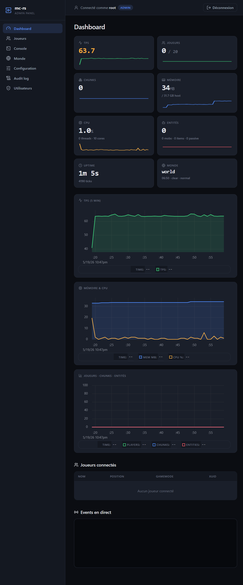
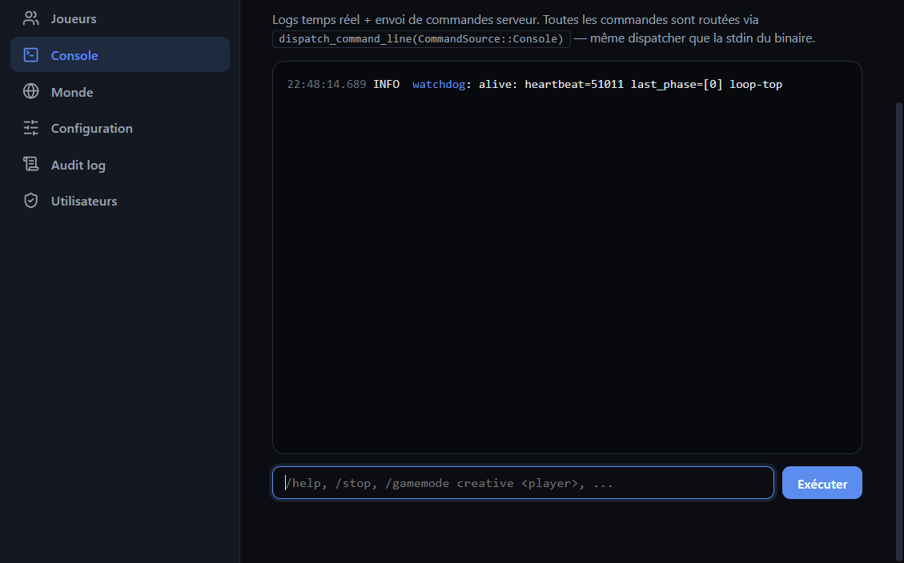
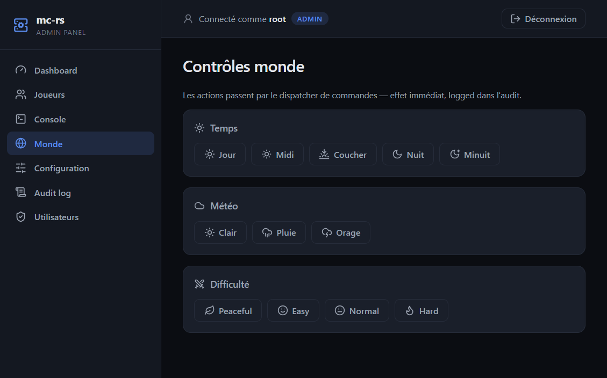
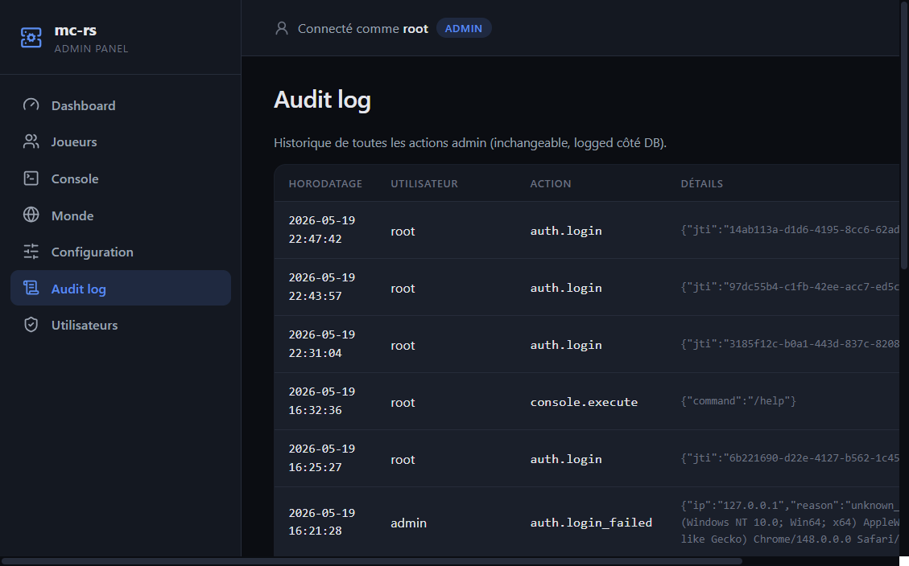
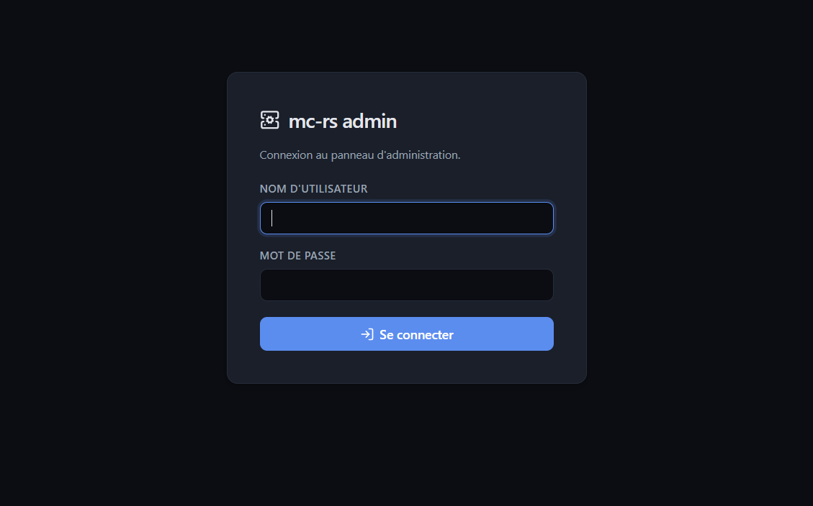

<p align="center">
  
  
  
  
</p>

# MC-RS

A high-performance **Minecraft Bedrock Edition** server written entirely in Rust.

MC-RS targets **protocol version 975** (Minecraft Bedrock 1.26.20). It implements the full server-authoritative gameplay loop — movement, combat, inventory, world generation, crafting, and more — with a Lua plugin runtime. The codebase is a 7-crate workspace of ~90K lines of Rust, faithfully porting PocketMine-MP packet by packet.

## Features

- **Full RakNet Implementation** — UDP transport with fragmentation, ordering, reliability, and encryption (ECDH P-384 + AES-256-CTR)
- **World Generation** — Simplex 3D terrain with biomes, caves, ores, trees, water, and structures (villages, temples, mineshafts, strongholds, monuments); Overworld, Nether and End dimensions
- **Entities** — entity/mob system with multiple mob types, AI behaviours, pathfinding, and natural spawn/despawn
- **Complete Survival** — Hunger, fall damage, drowning, lava, combat with armor/enchantments/criticals, crafting recipes, furnaces, enchanting tables, anvils
- **Plugin System** — `plugin.yml` manifests, Lua 5.4 scripting (mlua), event hooks, a tick scheduler, custom commands, and server-driven forms UI
- **Persistent Worlds** — LevelDB chunk storage, player data, level.dat, auto-save
- **65 Commands** — `/gamemode`, `/tp`, `/give`, `/fill`, `/clone`, `/scoreboard`, `/effect`, `/enchant`, `/summon`, `/transferserver`, and more
- **Anti-Cheat** — Movement validation, speed/reach checks, rate limiting, violation tracking
- **Server Admin** — RCON, Query protocol (GameSpy4), console REPL, web admin panel, permissions, whitelist, bans
- **Resource Packs & UI** — Server-driven pack delivery plus 8 custom form layouts via a title-flag UI dispatcher

## Workspace

The workspace is split into **7 crates** (~90K lines). World generation,
entities, and gameplay all live inside `mc-rs-server`.

| Crate | Description |
|-------|-------------|
| `mc-rs-server` | Main binary: tokio runtime, connection state machine, game loop, world generation & persistence, entities, gameplay, commands, plugins, RCON/Query |
| `mc-rs-proto` | Packet definitions, codec, VarInt/VarUInt serialization, zlib/snappy batches |
| `mc-rs-raknet` | RakNet transport (UDP, reliability, fragmentation, ordering, ACK/NACK) |
| `mc-rs-crypto` | ECDH P-384 key exchange, AES-256-CTR encryption, JWT chain verification |
| `mc-rs-nbt` | NBT little-endian (disk) + network (ZigZag VarInt) parser/serializer |
| `mc-rs-command` | Generic command engine: registry, parser, permissions, entity selectors |
| `mc-rs-webui` | Web admin panel (Axum, JWT auth, SQLite, live metrics over WebSocket) |

## Quick Start

```bash
# Build
cargo build --release

# Run tests (1165 tests)
cargo test

# Run the server
cargo run --release
```

The server reads configuration from `server.toml` (created on first run).

## Web Admin Panel

MC-RS ships with an integrated **web back-office** (`mc-rs-webui` crate) — no
external panel to set up, it boots with the server. Real-time monitoring,
remote control, player management and an audit trail, served straight from the
server binary.

<p align="center">
  
  
</p>
<p align="center">
  
  
  
</p>

### Enabling it

In `server.toml` (off by default for safety):

```toml
[webui]
enabled = true
bind = "127.0.0.1:8080"          # loopback only by default
database_url = "sqlite://webui.db"
session_duration_hours = 24
```

On first boot with an empty database, the panel redirects to `/setup` to
create the first administrator. After that, `/setup` is locked and login is
required.

### Pages

| Page | What it does |
|------|--------------|
| **Dashboard** | Live metrics — TPS, players, chunks, memory, CPU, entities, uptime — with 5-minute time-series charts (uPlot) and per-card sparklines |
| **Joueurs** | Connected players list with kick / op / deop / gamemode actions |
| **Console** | Live log stream + a command terminal that runs anything you'd type in the server console |
| **Monde** | One-click time / weather / difficulty controls |
| **Configuration** | View & hot-edit `server.toml` (validated + atomic write) |
| **Audit log** | Paginated, immutable history of every admin action (who, when, what) |
| **Utilisateurs** | Admin-only user CRUD (create / delete / password / role) |

### How it works

The panel is wired into the server through three lightweight channels — **no
duplication of game logic**:

1. **Commands** — every admin action (stop, kick, op, `/time`, `/weather`…)
   is pushed into the same `console_tx` channel that feeds the server's stdin
   console, then dispatched via the existing `dispatch_command_line`. The web
   layer never reimplements gameplay.
2. **State snapshot** — an `Arc<RwLock<ServerSnapshot>>` is refreshed by the
   main loop (~20 Hz: TPS, players, chunks, world; ~1 Hz: system metrics +
   5-minute history ring-buffers) and **pushed over WebSocket** to connected
   browsers. Zero polling.
3. **Events & logs** — server events (join/quit/chat/death/gamemode) and every
   `tracing` log line are fanned out over `broadcast` channels and streamed
   live to the dashboard & console.

Auth is multi-user with **Argon2id** password hashing and **JWT** sessions
(secret auto-generated and persisted on first boot). Login is rate-limited
(5 attempts / 5 min / IP). Storage is pluggable: **SQLite** by default,
**PostgreSQL** and **MongoDB** behind feature flags. Optional **TLS** via the
`tls` feature. UI is server-rendered (Askama + htmx + Alpine.js + Lucide
icons) — no JS build step.

> A full reference doc will come later — this is just a quick tour.

## Documentation

Full documentation is available at:

**[https://pedrokarim.github.io/mc-rs/](https://pedrokarim.github.io/mc-rs/)**

## License

This project is licensed under the [MIT License](LICENSE).
